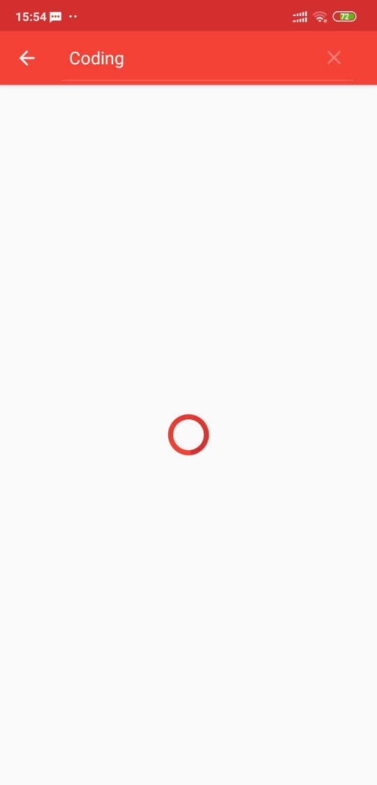
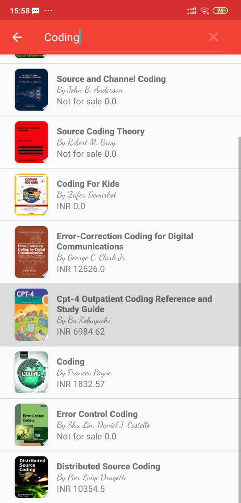

# GoogleBooks
📚🌐Allow a user to get a list of published books on a given topic, Using the google books API in order to fetch results and display them to the user in Recyclerview
# Screenshots
<table>
<tr>
<td></td>
<td></td>
</tr>
<tr>
<td></td>
<td></td>
</tr>
</table>
